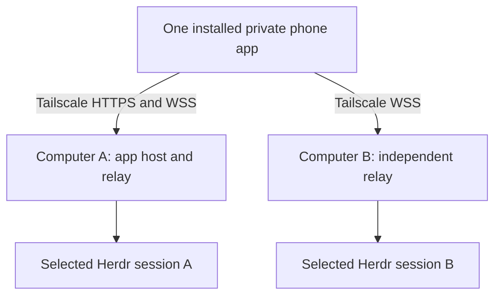
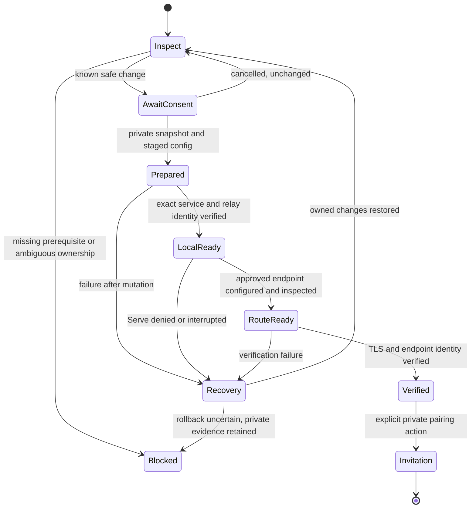
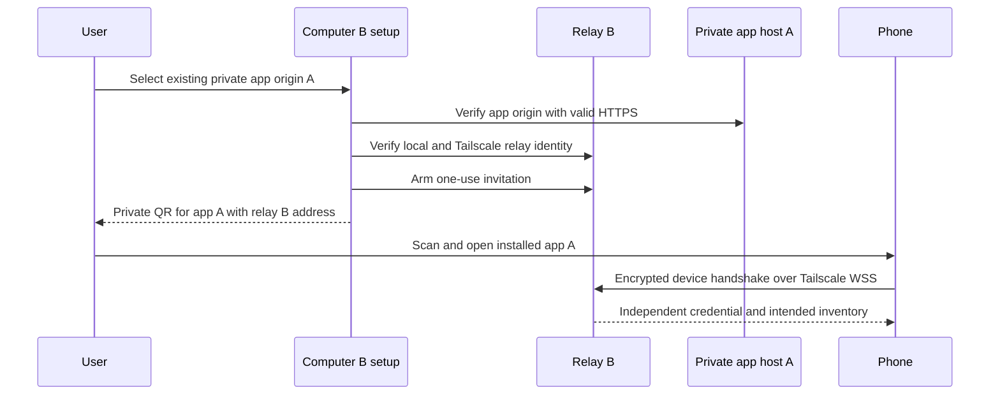
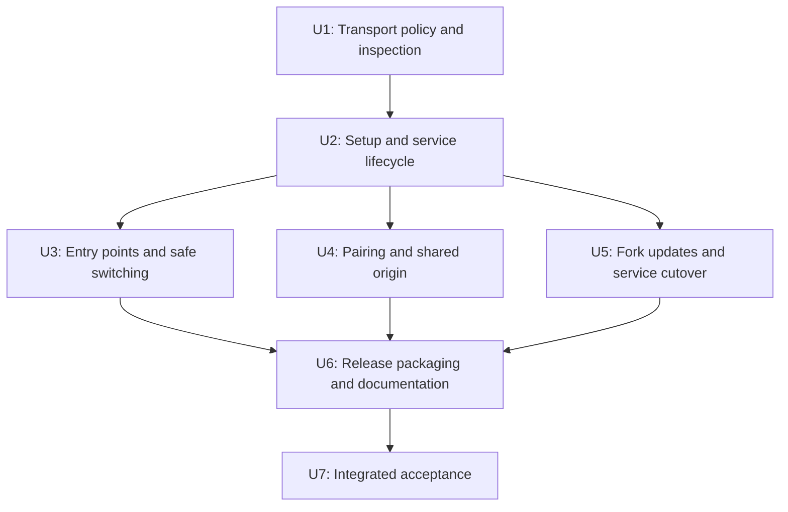

# Tailscale-First Linux - Plan

## Goal Capsule

- **Objective:** Make private phone access over Tailscale the default guided setup for Linux users of this fork.
- **Product authority:** The owner confirmed Tailscale-first rather than Tailscale-only, Linux first, an already-connected Tailscale prerequisite, one private multi-computer app, and deferred rebranding.
- **Open blockers:** None for implementation; live migration, privileged integration tests, and release publication require separate authorization.
- **Execution profile:** Extend existing shell setup and packaged Go helpers, with characterization tests around service replacement and updates.
- **Tail ownership:** The implementer supplies automated evidence; the owner approves live migration, phone acceptance testing, and publication.
- **Safety boundary:** Developing the fork does not authorize replacing the working relay installation or altering its paired-device state.

---

## Product Contract

### Summary

Provide a Tailscale-first Linux setup that configures a persistent relay, private HTTPS access, and phone pairing without a hand-written runbook.
The first computer hosts the private phone app; additional computers can join that same installed app through their own Tailscale connections.
Cloudflare and gateway transports remain explicit alternatives.

### Problem Frame

The working Linux installation required manual configuration, a custom user service, privileged Tailscale Serve setup, and a separate QR helper.
Interactive sudo and QR visibility caused repeated handoffs between the assistant and the human.
The shipped quick-start documentation instead leads users through Cloudflare or gateway setup.

### Key Decisions

- **Tailscale-first, not Tailscale-only.** Make the private-network path the default without removing upstream alternatives or silently converting existing installations.
- **Linux with systemd first.** Reuse the proven deployment model while leaving existing macOS transports available.
- **Connected Tailscale is a prerequisite.** Guide missing prerequisites rather than installing Tailscale, joining a tailnet, or changing its global preferences.
- **One private app across computers.** Additional relays target the existing app origin rather than forcing a separate app installation per machine.
- **Defer rebranding.** Retain current technical identity and upstream attribution while making the fork's distribution ownership explicit.

### Requirements

**Setup and consent**

- R1. A fresh supported Linux installation presents Tailscale as the default setup path, with other transports available by explicit selection.
- R2. Setup validates a connected Tailscale installation and an intended, available Herdr session before exposing the relay.
- R3. The guided flow configures the relay, its persistent user service, private HTTPS route, and pairing invitation without manual configuration-file editing.
- R4. Privileged operations require human approval and password entry in the human's terminal; secrets must not pass through an assistant transcript.
- R5. Setup explains certificate-transparency hostname disclosure before requesting HTTPS setup and distinguishes login startup from unattended boot startup.

**Private transport and safe coexistence**

- R6. Tailscale mode keeps the relay bound to loopback and uses tailnet-only Tailscale Serve for phone HTTPS and WebSocket access.
- R7. Tailscale mode never enables Funnel, public port mapping, or automatic fallback to a Cloudflare tunnel or application gateway.
- R8. Setup preserves unrelated Serve routes, services, and tailnet preferences, stopping with actionable guidance when resources conflict.
- R9. Rerunning setup or adopting a compatible existing installation preserves relay identity and paired devices; changes to existing configuration require review and consent.
- R10. Normal relay restart and app close/reopen retain pairing, and unavailable Tailscale produces a clear connection failure rather than a transport switch.

**Phone experience and multiple computers**

- R11. The first computer can serve the bundled phone app privately through its Tailscale hostname.
- R12. Additional computers can generate invitations for that same app origin while retaining distinct relay addresses, identities, and credentials.
- R13. Setup displays a private, scannable one-use QR with platform-specific pairing guidance and provides an explicit way to regenerate expired invitations.
- R14. Completion distinguishes verified HTTPS/readiness from human-confirmed authenticated phone access to the intended inventory.
- R15. Documentation explains that the shared app host must be reachable to load or update the app; automatic host failover is not promised.

**Fork ownership and compatibility**

- R16. Cloudflare and gateway setup remain supported alternatives, including the existing macOS paths.
- R17. The fork's installation and update flow must not silently replace its Tailscale behavior with upstream defaults.
- R18. Preserve AGPL-3.0-or-later licensing, upstream copyright, and applicable source-availability obligations.

### Key Flows

- F1. First Linux computer
  - **Trigger:** Owner starts fresh setup with Herdr and Tailscale already available.
  - **Steps:** Validate prerequisites and session; review existing resources; disclose HTTPS implications; obtain required approval; configure private service and route; verify health and TLS; display QR; guide phone installation and pairing.
  - **Outcome:** The phone connects to the intended inventory, and the owner can close/reopen the app without a new invitation.
  - **Covers R1-R8, R11, R13-R14.**
- F2. Additional computer
  - **Trigger:** Owner wants another Linux computer in an existing private phone app.
  - **Steps:** Configure that computer's private relay; select the existing app origin; generate its invitation; pair using the installed app.
  - **Outcome:** One app shows multiple independent computers without copying credentials or changing the existing app origin.
  - **Covers R9, R12, R15.**
- F3. Repeat setup or recover from failure
  - **Trigger:** Setup is rerun, interrupted, or encounters a missing prerequisite or occupied resource.
  - **Steps:** Inspect the existing state; preserve identity and unrelated resources; explain the blocker or proposed change; resume only after required consent.
  - **Outcome:** No duplicate conflicting service, destructive reset, or unapproved public fallback.
  - **Covers R2, R4, R8-R10.**

### Acceptance Examples

- AE1. **Covers R1-R5, R11, R13-R14.** Given a supported fresh Linux host with connected Tailscale and a live Herdr session, completing the guided flow yields verified private HTTPS and a usable QR without hand-editing configuration.
- AE2. **Covers R2, R7-R8.** Given missing or disconnected Tailscale, setup stops with guidance and does not install it, reset tailnet settings, or choose a public transport.
- AE3. **Covers R4, R8.** Given an unrelated service occupying the proposed Serve endpoint, setup leaves it unchanged and explains the conflict rather than overwriting it.
- AE4. **Covers R9-R10.** Given an existing paired installation, repeating setup and restarting the relay leaves the same phone credential usable without a new QR.
- AE5. **Covers R12-R15.** Given one private installed app, pairing a second computer adds its inventory to that app without replacing the first computer's identity or credentials.
- AE6. **Covers R6-R7, R10.** Given loss of Tailscale reachability, phone access fails clearly and no Cloudflare, gateway, public port mapping, or Funnel fallback is activated.
- AE7. **Covers R13-R14.** Given an expired invitation, the owner can generate a fresh QR privately; a loaded web page alone is not reported as successful pairing.
- AE8. **Covers R16-R17.** Given an explicitly selected alternative transport, setup respects that choice; a later fork update does not silently change a Tailscale installation's transport.

### Scope Boundaries

- Defer native macOS Tailscale setup, rebranding, and unrelated product improvements.
- Do not automatically install or enroll Tailscale, alter global tailnet policy, or enable public access.
- Do not automatically enable linger, disable sleep, or promise Herdr/agent resurrection after reboot.
- Do not introduce app-host failover or silently migrate app storage between origins.
- Do not treat Tailscale-only relay transport as a claim that all ancillary traffic is private; browser push services and release downloads require separate documentation.
- Do not deploy the development fork over the working installation without a separate approved migration.

### Dependencies and Assumptions

- Supported initial hosts use Linux, systemd user services, and a normal non-root account; exact distributions and architectures remain a planning question.
- The phone and computers belong to an appropriately authorized tailnet, with HTTPS and network policy permitting the selected endpoints.
- The selected Herdr session must be available independently of the relay service.
- The local installation established single-host feasibility and human-reported phone pairing; multi-computer shared-origin pairing and restart reconnection still need verification.

### Planning Resolutions

The Planning Contract resolves the technical questions without changing R1-R18: recognized runbook adoption and recovery (KTD3-KTD4), shared-origin pairing (KTD5), fork-owned distribution (KTD6), and the initial Linux validation matrix (KTD7).

### Sources

- [Fork repository](https://github.com/dima-m711/herdr-mobile-relay), initially cloned from upstream main at `babc35e`.
- `README.md` and `QUICKSTART.md`: current transport choices, app-origin selection, and invitation behavior.
- `LICENSE`: AGPL-3.0-or-later license declaration.
- [Tailscale Serve documentation](https://tailscale.com/kb/1312/serve) and [HTTPS setup](https://tailscale.com/kb/1153/enabling-https).

---

## Planning Contract

**Product Contract preservation:** R1-R18, F1-F3, AE1-AE8 and scope boundaries unchanged; the planning-question subsection now points to its resolutions.

### Research and Existing Patterns

| Surface | Evidence | Consequence |
|---|---|---|
| Setup routing | `relay/plugin-setup-menu.sh` defaults to temporary Cloudflare; `relay/plugin-choose-transport.sh` infers transport from gateway settings | Introduce an explicit Tailscale selection without changing legacy inference for unmarked installs |
| Service management | `relay/common.sh`, `relay/service.sh`, `relay/plugin-build.sh` and `relay/plugin-status.sh` hardcode the standard Linux unit | Resolve the exact managed service consistently across setup, diagnostics, updates and uninstall |
| Recovery | `relay/native-install-transaction.sh` snapshots units, environment and activation, then verifies readiness on rollback | Reuse native transaction behavior; add a separate, narrowly scoped Serve ownership record |
| Runtime policy | `internal/config/config.go` already carries loopback, gateway, port-mapping and bootstrap controls; `internal/app/hybrid.go` skips hybrid networking with no gateways | Validate Tailscale invariants at runtime rather than rely solely on shell defaults |
| Pairing | `relay/common.sh` chooses app origins, encodes private fragments and renders width-aware QR codes; `relay/setup-link.sh` accepts a separate relay hostname | Extend the existing invitation path; preserve encrypted device authentication and cross-origin relay access |
| Upgrades | `relay/common.sh:release_repository` discovers a fork for initial downloads, but `internal/update/{manager,stage,worker}.go` and `frontend/src/lib/updates.ts` hardcode upstream | Pin this distribution's installer and updater to the fork together |
| Release packaging | `scripts/package-release.sh` copies an explicit wrapper list; `.github/workflows/release.yml` publishes four native targets after verification | Include every new runtime helper in bundles; retain existing macOS artifacts |
| Verification | `Makefile`, `tests/test_native_install.sh`, `tests/test_plugin_build.sh`, `tests/test_common.sh` and `tests/blackbox/relay_test.go` supply shell and compiled fixtures | Use disposable homes, fake service/Tailscale commands and real isolated relay tests; never probe production Herdr to prove implementation |

No `docs/solutions/` learnings were found in this checkout.
Official Serve documentation confirms post-1.52 CLI semantics, persistent background routes, port-scoped disabling, tailnet access controls, and the distinction between Serve and Funnel.
HTTPS documentation establishes the public certificate-transparency disclosure; Serve manages certificates, so this design does not generate certificate files itself.

### Key Technical Decisions

- KTD1. **Explicit Tailscale mode with runtime enforcement.** Introduce `HERDR_CONNECTION_MODE=tailscale` for this path; unset mode retains existing behavior. Setup records the loopback listener, empty gateway list, disabled port mapping, forced relay transport, and disabled bootstrap reset. `internal/config/config.go` rejects unsafe combinations in Tailscale mode, including a missing key. Do not interpret an empty gateway setting alone as proof of Tailscale mode.
- KTD2. **Shell orchestration, compiled JSON inspection.** Keep prompts, systemd operations and Tailscale CLI invocation in shell scripts. Extend packaged Go setup helpers to parse bounded Tailscale JSON and validate selected endpoints without introducing a `jq`, Python, Node or Go-toolchain dependency for installed users. Do not embed the Tailscale daemon or add a Go Tailscale dependency.
- KTD3. **Distinct, managed Linux service.** Use `herdr-mobile-relay-tailscale.service`, matching the runbook, and a packaged Tailscale-only launcher. Resolve only recognized standard or Tailscale units rather than execute an arbitrary service name from configuration. Preserve the existing plugin ID and persistent config directory. If multiple relevant services or ambiguous ownership exist, stop before mutation. Recognized runbook adoption is opt-in, backed up, and switches only the launcher/unit definition; identity and device state remain in place.
- KTD4. **Narrow Serve ownership and resumable setup.** Default to HTTPS 8443 and loopback TCP 8375/UDP 8376; permit an explicitly chosen alternate HTTPS port on conflict. Persist a private, versioned `tailscale-setup.json` record containing selected hostname, port, target, service/environment identity, completed phase, and whether the route was created or adopted. Never reset or restore all Serve configuration. Re-read before mutation and compare unrelated configuration afterward; concurrent or unknown state aborts with recovery guidance.
- KTD5. **Separate app origin from relay endpoint.** First-host setup defaults the app to this machine's verified HTTPS origin; adding a host asks for the existing private HTTPS app origin and independently verifies this relay's WSS endpoint. Reuse compiled origin normalization and the existing invitation fragment. In Tailscale mode bypass Cloudflare-origin discovery and reject public/non-Tailscale app origins. Keep the app origin stable during ordinary restarts and reruns. Do not tighten shared WebSocket origin rules in a way that breaks authenticated cross-origin pairing.
- KTD6. **Fork-owned releases end to end.** Default initial downloads, release discovery, staged assets, plugin update installation, and displayed update instructions to `dima-m711/herdr-mobile-relay`. Keep Go import paths and plugin identity unchanged. Preserve archive checksums, manifest/revision checks and upgrade compatibility gates. Missing fork assets fail with guidance, never fall back to upstream. Use a new numeric release version, since both backend and frontend currently accept only three-part numeric versions; exact numbering is chosen at release preparation, not by retagging upstream v0.21.3.
- KTD7. **Bounded support matrix.** Initial Tailscale setup supports Linux amd64 and arm64 with systemd user services, default XDG config/data locations, and a connected Tailscale client exposing the post-1.52 Serve CLI. Reject unsupported/custom layouts before mutation with instructions rather than guess. Validate on Ubuntu and Arch/Omarchy; retain existing macOS alternatives and cross-builds. Older/newer JSON forms require fixtures and explicit support, not permissive parsing.
- KTD8. **Human permissions remain at the terminal.** Use existing Tailscale operator permissions when present; otherwise present the exact narrow privileged command and use an attached terminal for sudo. Do not set an operator, alter ACLs, enable linger, run installers as root, or enable daemons silently. Cancellation/non-interactive execution exits without hanging or printing an invitation. Tailnet HTTPS consent is completed by the human.

### Setup Lifecycle and Recovery

The state record is evidence of ownership, not permission to overwrite resources.
Keep it and recovery backups private; never record QR fragments, keys, device credentials, or the whole tailnet inventory in diagnostic output.
Use a per-config lock shared by setup, teardown, transport switching and plugin service cutover so local actions cannot race.
The lock is held by the top-level mutating operation; nested installers participate without reacquiring the same lock and deadlocking.
External administrators can still change Serve concurrently; the CLI does not provide a transaction spanning our files, systemd and Serve.
On a conflicting post-check, preserve evidence and stop rather than overwrite the administrator's newer configuration.

- A matching existing route can be adopted only after verifying its proxy target and intended relay identity; adoption itself changes no route.
- Parse `AllowFunnel` as a host/port-to-boolean mapping, not a top-level boolean. Reject public exposure on the selected endpoint and inspect foreground/other endpoint owners that could collide; preserve unrelated Funnel entries without misreporting the relay as public.
- Conflicting TCP mode, handler paths, another proxy target, malformed JSON, unreadable Serve state or uncertain endpoint ownership prevent setup.
- Before replacing the runbook unit, validate its owner, safe file types, exact environment path and launcher shape, selected socket, and health instance; unknown wrappers are not executed to discover intent. Back up with permissions intact.
- Failed local installation restores previous unit/environment/release pointers and activation through the existing native recovery pattern. Never erase `device-auth/` or roll credentials backward after live pairing.
- A route created by this attempt can be removed on rollback only when it still exactly matches the recorded endpoint and proxy and contains no newly added handlers. An adopted route is left intact. An uncertain privileged rollback remains an explicit incomplete recovery, not success.
- Installation verifies TLS without `-k`, `/readyz` instance/version/revision/web identity, inactive gateway, and the actual service PID/listener. Local HTTPS failure may need a second-tailnet-device check; report remote verification pending rather than claim pairing.
- Normal service startup does not re-run Serve, reset pairing, or require network availability as a permanent startup gate.

### Mode and Entry-Point Rules

| Existing state | Default action | Mutation boundary |
|---|---|---|
| Fresh supported Linux host | Offer Tailscale first | Validate prerequisites and ask before changes |
| Recognized Tailscale installation | Resume/status/QR using its saved endpoint | No identity regeneration or automatic app-origin change |
| Recognized runbook installation | Offer adoption | Explicit backup-and-adopt confirmation |
| Existing gateway/Cloudflare installation | Show current transport; keep it | Explicit switch only; no silent conversion on update |
| Multiple services or unknown unit/route | Stop with conflict details | No service stop, overwrite or bulk cleanup |
| macOS | Existing alternatives | No Linux Tailscale service operations |

Selecting an alternative from Tailscale is a deliberate transport switch, not an in-place gateway-env edit beneath a Tailscale launcher.
Require explicit cleanup/disable of the owned Tailscale service and route before entering the existing alternative setup path; retain credentials unless the separate full-uninstall confirmation requests deletion.
The ordinary Tailscale teardown action removes only verified owned resources and retains pairings.
The existing full-uninstall action must learn the selected service and refuse destructive state deletion while that service or an unhandled owned route remains.

### Shared App and Update Sequence

Updating app host A replaces its bundled web app through the verified relay release; it does not deploy Cloudflare Pages.
Updating B does not publish or relocate A's app.
Retain existing compatibility gates for a temporarily mixed-version app and relays, and test that an unavailable shared app host produces an honest update/connectivity status.
The app host and additional relay must both be tailnet-accessible from the phone; HTTPS hostname syntax alone is not proof of tailnet membership or reachability.

### Sequencing

### System-Wide Impact and Alternatives

- **Wire compatibility:** Tailscale is a deployment mode carrying the existing encrypted WebSocket protocol, not a new wire transport identifier. Preserve release transport compatibility metadata and device authorization; do not trust Tailscale identity headers as application credentials.
- **Action parity:** Named plugin actions and direct scripts share setup, status, QR and teardown logic. Agent-accessible diagnostics stay sanitized; password entry, HTTPS consent and QR scanning remain human-only terminal actions.
- **State ownership:** Setup owns mode/endpoint/service metadata, the relay owns device credentials, and Tailscale owns certificates. Updater rollback must not replace live device state or replay a full Serve snapshot.
- **Failure propagation:** Setup failure returns nonzero with a completed phase and safe next step. Restart failure is reported for the selected unit; an HTTP response from a different PID/instance cannot count as recovery.
- **Rejected alternatives:** Embedding Tailscale would expand credential and daemon ownership; a generic transport-framework rewrite would increase upstream divergence. A separate sidecar runbook would leave update and uninstall blind to the service. The chosen approach adds one recognized mode to existing mechanisms.

### Risks and Deferred Execution Checks

- **CLI drift:** Official docs warn that text and JSON status differ for Tailscale Services; v1 targets device endpoints, not virtual Services. Unknown/colliding state must block rather than be ignored.
- **Adoption:** The runbook uses a shell wrapper and `%h` systemd paths unlike the existing parser's expectations. Add an explicit recognizer rather than broaden all service parsing to arbitrary shell syntax.
- **Updater safety:** Merely changing URLs is insufficient; service discovery, restart, rollback and readiness must target the Tailscale unit. Package the launcher before an update can reference it.
- **No published fork bundle yet:** Local source work and fixture tests can proceed, but the advertised install command becomes usable only after a verified fork release is published with separate approval.
- **Shared-origin devices:** Browser tests cannot prove iOS Home Screen invitation consumption or real tailnet ACLs; retain a human/device acceptance gate.
- **Runbook drift:** Re-inspect the actual runbook installation during an approved migration. Do not infer its current state from this plan or read its credentials into logs.
- **Version choice and environment availability:** Release numbering, available ARM64/Arch runners, and actual client versions are execution-time checks. Record unavailable validations as limitations, not passes.

---

## Implementation Units

### U1. Define Tailscale mode and safe inspection primitives

**Goal:** Give setup and runtime one explicit private-transport contract.

**Requirements:** R2, R6-R8, R10; AE2, AE6.
**Dependencies:** None.
**Files:** Modify `internal/config/config.go`, `internal/config/config_test.go`, `cmd/herdr-mobile-relay/main.go`, `cmd/herdr-mobile-relay/main_test.go`, `cmd/herdr-mobile-relay/command_test.go`; create `internal/setuphelper/tailscale.go`, `internal/setuphelper/tailscale_test.go`, `relay/tailscale-common.sh`, `tests/test_tailscale_common.sh`.

**Approach:** Add the opt-in mode and reject incompatible runtime settings. Use packaged helper commands for bounded status/Serve JSON parsing and normalized endpoint inspection. Keep privileged commands out of Go helpers. Reject unknown mode values; preserve existing unset-mode behavior. Resolve hostname, port and target as validated data, never executable shell output.
**Patterns:** `internal/setuphelper/setuphelper.go`, `relay/common.sh:systemd_quoted`, and existing command tests.
**Execution note:** Characterize unset-mode behavior before adding validation.

**Test scenarios:**
- Covers AE2. Missing Tailscale, logged-out backend, empty DNS name or incompatible status JSON returns actionable failure without writes.
- Covers AE6. Tailscale mode with wildcard bind, gateway, port mapping, bootstrap reset, or missing key is refused; legacy configurations remain valid.
- Empty configuration, matching private route, occupied port, extra handler and selected-endpoint Funnel exposure classify distinctly.
- Nested/background/foreground owners and unrelated Funnel entries cannot hide conflicts or cause unrelated services to be changed.
- Oversized/malformed JSON, invalid ports, control bytes and shell metacharacters never become executable commands or secret-bearing diagnostics.

**Verification:** Policy and parser tests demonstrate fail-closed handling without production Tailscale access or new runtime dependencies.

### U2. Implement transactional setup, adoption and teardown

**Goal:** Create a persistent private Linux relay while preserving existing resources and identity.

**Requirements:** R2-R10; F1, F3; AE1-AE4, AE6.
**Dependencies:** U1.
**Files:** Create `relay/tailscale-setup.sh`, `relay/tailscale-service.sh`, `relay/tailscale-teardown.sh`, `tests/test_tailscale_setup.sh`; modify `relay/tailscale-common.sh`, `relay/native-install-transaction.sh`, `tests/test_native_install.sh`.

**Approach:** Preflight regular-user/systemd context, default paths, selected socket and executable, local ports, and Serve ownership. Stage private config and state before activation. Install the distinct unit with restrictive umask and selected socket, verify identity, then request scoped Serve configuration and verify HTTPS. Acquire the config lock before mutation and retain resumable state. Support recognized runbook adoption only after an explicit diff/backup confirmation. Share native rollback primitives only where semantics match; do not funnel all existing services through a broad refactor.
**Patterns:** `relay/stable-setup.sh` ownership/resume logic and `relay/native-install-transaction.sh` file/activation recovery.
**Execution note:** Use disposable homes and fixture command binaries; real privileged acceptance is separate.

**Test scenarios:**
- Covers AE1. Fresh setup creates a loopback-only unit and the approved private endpoint, checks exact identity, and records ownership.
- Covers AE3. Existing port/route, additional handler, unreadable state or an administrator change between snapshots causes a safe stop.
- Covers AE4. Recognized runbook adoption and repeat setup preserve token, instance and device-auth contents; unknown/symlinked definitions are rejected.
- Sudo denial, user cancellation, EOF, browser-consent interruption, missing user bus or unsupported paths cannot leave reported success or a hanging prompt.
- Failure at each post-mutation phase restores owned files and activation; rollback refusal retains private evidence and leaves unrelated routes unchanged.
- Teardown removes a matching owned route/service only, leaves adopted/external changes untouched unless specifically approved, and retains pairing data.

**Verification:** Failure-injection coverage proves safe recovery and secret-free diagnostics; lint validates the generated unit and launcher.

### U3. Integrate setup, service management and diagnostics

**Goal:** Make Tailscale the normal Linux path across every existing user entry point.

**Requirements:** R1, R3-R5, R8-R10, R16; F1, F3; AE1-AE3, AE8.
**Dependencies:** U2.
**Files:** Modify `herdr-plugin.toml`, `relay/plugin-setup-menu.sh`, `relay/plugin-choose-transport.sh`, `relay/plugin-quick-start.sh`, `relay/start.sh`, `relay/common.sh`, `relay/service.sh`, `relay/plugin-status.sh`, `relay/uninstall.sh`, `relay/uninstall-systemd-user-service.sh`, `Makefile`; create `tests/test_tailscale_entrypoints.sh`; extend `tests/test_common.sh`, `tests/test_uninstall.sh`.

**Approach:** Add named setup/teardown actions using the existing plugin-pane mechanism, default fresh Linux choices to Tailscale, and preserve existing transport intent. Centralize recognized service selection with an allowlist and ambiguity detection. Route quick-start/restart/status/logs/uninstall through the selected service. Guard legacy temporary/stable actions against silently rewriting a Tailscale installation. Provide non-secret state summaries and exact next actions when human interaction is required.
**Patterns:** Existing setup-menu action pause handling and `relay/open-plugin-pane.sh`.

**Test scenarios:**
- Fresh Linux default enters Tailscale; explicit alternatives and macOS still route to their existing flows.
- Covers AE8. Merely reopening setup or updating a plugin preserves the recorded transport.
- Existing Tailscale quick-start restarts only the selected unit and does not spawn cloudflared, register a gateway, or create a duplicate relay.
- Multiple standard/custom units or a malicious service-name value refuses service mutation.
- Switching away requires consent and owned-resource cleanup; full uninstall cannot delete active Tailscale credentials without the existing destructive confirmation.
- Status output distinguishes local health, private route verification and unconfirmed phone pairing without leaking invitations or credentials.

**Verification:** Every user entry point has an explicit Tailscale behavior; legacy branch tests remain intact.

### U4. Deliver persistent private QR pairing and shared origins

**Goal:** Make the QR visible and repeatable for one app controlling independent Tailscale relays.

**Requirements:** R9-R15; F1-F2; AE4-AE7.
**Dependencies:** U2; U3 integration before end-to-end acceptance.
**Files:** Modify `relay/setup-link.sh`, `relay/plugin-setup-link.sh`, `relay/common.sh`, `relay/tailscale-setup.sh`; create `tests/test_tailscale_pairing.sh`; extend `tests/test_common.sh`, `internal/setuphelper/setuphelper_test.go`, `frontend/tests/browser/mobile-journeys.spec.ts` and `frontend/tests/unit/transports.test.ts` as needed for shared-origin coverage.

**Approach:** Derive the relay endpoint from verified Tailscale state, not Cloudflare config. Offer this host or an existing private app origin using existing normalization, recording and fragment helpers. Validate this relay independently from the app host. Require successful invitation arming before reporting a ready invitation, then keep the private terminal display visible until the human dismisses it. If too narrow for QR, explain how to widen/reprint rather than imply a QR exists. Avoid printing a second fallback invitation into a different app origin. Retain authentication; tailnet membership or proxy headers never replace device credentials.
**Patterns:** `relay/common.sh:choose_phone_app_base_url`, `print_phone_setup`, `arm_setup_link`; existing browser onboarding tests.

**Test scenarios:**
- Covers AE5. App origin A and relay endpoint B remain distinct in the invitation; B has its own key and device store.
- Covers AE7. Expired invitation can be regenerated; failed arming or unhealthy/wrong-instance relay cannot report a usable invitation.
- Narrow terminal, terminal closure and return-to-menu preserve readable guidance; QR is never emitted by status or event-log actions.
- Invalid/public app origin, changed Tailscale hostname and unreachable shared app host produce explicit guidance without silent origin migration.
- Covers AE4. A paired device reconnects after relay restart and app reopen without bootstrap reset.
- Real two-origin browser handshake succeeds with existing encrypted auth; forged identity headers or an unpaired client remain unauthorized.

**Verification:** Automated tests validate URL/origin separation using fake secrets; real phone scan/reopen remains a human gate.

### U5. Preserve fork ownership and Tailscale service across updates

**Goal:** Prevent managed updates from reverting transport policy or selecting the wrong service/repository.

**Requirements:** R9-R10, R16-R18; AE4, AE8.
**Dependencies:** U2 and the service resolver from U3.
**Files:** Modify `install.sh`, `relay/plugin-build.sh`, `relay/plugin-setup-menu.sh`, `internal/update/manager.go`, `internal/update/stage.go`, `internal/update/worker.go`, `frontend/src/lib/updates.ts`; extend `tests/test_install.sh`, `tests/test_plugin_build.sh`, `tests/test_plugin_recovery.sh`, `internal/update/manager_test.go`, `internal/update/worker_test.go`, `internal/update/stage_test.go`, `frontend/tests/unit/updates.test.ts`.

**Approach:** Change distribution endpoints/instructions to the fork while retaining explicit validated installer overrides and immutable release identity checks. Extend plugin cutover recognition, backup, launcher-path rewrite, restart and rollback for the Tailscale unit. Unattended updates may resume a recognized installation but cannot perform first-time runbook adoption or a transport switch. Preserve private mode/state through configuration migration. Keep shared-app updates local to the serving host rather than invoking Cloudflare deployment.
**Patterns:** Existing revision-pinned `installPlugin`, staged checksum/manifest verification, and plugin-build recovery.

**Test scenarios:**
- Update discovery, checksums, archives and plugin source all resolve to the fork; missing releases or mismatched identities fail without upstream fallback.
- Covers AE8. Tailscale update restarts the right unit, retains its mode/origin/credentials/Serve record, and invokes no Cloudflare operation.
- Covers AE4. Failed replacement restores the previous release/unit and exact readiness identity without rolling back enrolled devices.
- Unrecognized installation during unattended update blocks before release activation, rather than attempting migration.
- App-host update serves the new verified web bundle; non-host update leaves the existing app origin alone and respects compatibility gates.
- Existing macOS and alternative-transport update tests pass; public-fork installation does not solicit or persist unnecessary GitHub credentials.

**Verification:** Fixture integration covers a complete fork update and rollback, not only URL string assertions.

### U6. Package and document the supported distribution

**Goal:** Make the packaged fork, published instructions and acceptance claims match the implementation.

**Requirements:** R1, R3, R5, R13-R18.
**Dependencies:** U3-U5.
**Files:** Modify `scripts/package-release.sh`, `scripts/check-installed-release.sh`, `internal/release/manifest.go`, `internal/release/manifest_test.go`, `tests/test_release_scripts.sh`, `Makefile`, `.github/workflows/check.yml`, `.github/workflows/release.yml`, `README.md`, `QUICKSTART.md`, `docs/transports.md`, `docs/development.md`, `docs/security.md`, `docs/updates.md`, `.env.example`; create `docs/tailscale.md`.

**Approach:** Add every required launcher/setup helper and its sourced dependencies, including `native-install-transaction.sh`, to the explicit bundle list. Add required-file coverage appropriate to new fork releases while preserving the ability to inspect/roll back older valid bundles. Wire new shell tests into CI. Keep four existing binary targets while defining the two Linux targets as the new setup support surface. Make fork installation and Tailscale the primary Linux documentation path, preserving alternatives and upstream attribution. Document separate app/relay origins, CT disclosure, ACLs, interactive sudo, QR privacy, login versus boot, recovery, and narrowly scoped teardown. Distinguish transport privacy from downloads, optional speech and web-push service traffic.
**Patterns:** Existing manifest-sealed bundles and native release smoke matrix.

**Test scenarios:**
- A built bundle contains executable Tailscale helpers and passes native manifest/identity checks without a source checkout.
- A missing helper or sourced dependency fails the new-release bundle gate even if packaging accidentally omits it from both archive and manifest; an altered listed file fails hash verification. Older bundles remain usable for rollback.
- Packaged setup can load all its dependencies without a source checkout or an end-user Go/Python/Node/jq installation.
- Fork install/update instructions identify the fork while copyright and license remain intact.
- All new tests run through the existing quality targets; no test publishes a release or accesses production credentials.

**Verification:** Packaging checks and documentation review agree on the same defaults and supported platforms; release publication remains separately approved.

### U7. Prove isolated end-to-end behavior and prepare rollout evidence

**Goal:** Verify the integrated feature without treating mocks as phone or tailnet proof.

**Requirements:** R1-R18; F1-F3; AE1-AE8.
**Dependencies:** U6.
**Files:** Create `tests/blackbox/tailscale_test.go`, `tests/test_tailscale_lifecycle.sh`; extend `tests/blackbox/relay_test.go`, `frontend/tests/browser/mobile-journeys.spec.ts`, `docs/tailscale.md`, `Makefile` and `.github/workflows/check.yml` for the relevant isolated acceptance gates.

**Approach:** Run a packaged relay against fake Herdr/disposable sockets with isolated home/config/state and reserved test ports. Combine fixture CLI/service fault injection with real HTTP/WebSocket credential tests. Document an opt-in real Linux/systemd/Tailscale acceptance procedure for disposable hosts; obtain explicit permission before any tailnet mutation or migration of the live runbook installation.
**Patterns:** `cmd/fake-herdr` and existing black-box test harnesses.

**Test scenarios:**
- Fresh install through pairing, app close/reopen, service restart, plugin update and route-preserving teardown succeeds with persistent credentials.
- Gateway and Cloudflare are not invoked in Tailscale mode; disconnected tailnet cannot trigger fallback.
- Named Herdr socket yields only its intended inventory; wrong socket or wrong-instance listener fails readiness.
- Two independent relays pair into one app origin and remain separate identities across updates.
- Unrelated Serve 443 route and unrelated Funnel route survive setup/update/teardown; selected-endpoint Funnel fails verification.
- Interrupted setup and update at each durable phase either resume safely or leave explicit recovery evidence without leaking secrets.

**Verification:** Automated evidence is reproducible; live-phone, systemd and tailnet observations are separately recorded as passed, blocked or not run.

---

## Verification Contract

Run from the repository root during implementation, not during planning.
Use disposable configuration/state and fake credentials for automated tests; no production Herdr inventory or secret QR capture.

| Gate | Scope | Evidence |
|---|---|---|
| `make shell-check production-path-audit` | U1-U6 | New shell fixtures included; no end-user toolchain calls |
| `go test ./internal/config ./internal/setuphelper ./internal/update ./cmd/herdr-mobile-relay` | U1, U4-U5 | Policy, parsing, command and updater regressions covered |
| `make backend-check` | U1-U5, U7 | Formatting, vet, tests and race checks pass |
| `make frontend-check` | U4-U6 | Fork instructions and pairing/update tests pass |
| `make frontend-browser` | U4, U7 | Cross-origin pairing and installed-app guidance pass browser scenarios |
| `make web-release` then `make web-release-check` | When shipped frontend changes | Committed web bundle matches source and browser-tested release |
| `make cross-build release-bundle-check` | U6-U7 | All existing targets build; current-host packaged smoke passes |
| `make check` | Final automated gate | Integrated upstream quality contract remains green |
| Opt-in Linux acceptance on amd64/arm64, Ubuntu and Arch/Omarchy | U2-U7 | Actual user service, private Serve route and TLS verified with explicit approval |
| Human iPhone/Android acceptance and two tailnet computers | U4, U7 | Scan, correct inventory, app reopen, restart reconnect and shared origin verified |

No `release:validate` target exists in this repository; use the release-bundle and native smoke gates instead.
Real Tailscale tests are not a requirement for ordinary pull-request CI credentials, but missing live evidence prevents declaring the deployment fully verified.
The current release workflow disables its mobile job, so a green release workflow alone does not prove installed-phone behavior.
Record any unavailable architecture/browser/device gate as a limitation with an owner, never as a pass.

---

## Definition of Done

- U1-U7 deliver the confirmed Product Contract without unrelated transport or UI rewrites.
- Every AE has corresponding automated evidence or an explicitly outstanding human/device validation gate.
- Tailscale mode rejects unsafe configuration and keeps device authentication, identity and pairings intact.
- Setup, repeat setup, cancellation, restart, update, rollback and teardown consistently select the intended service and preserve unrelated routes.
- Fork-owned installation/update endpoints and verified release bundles agree; no silent upstream fallback remains.
- Documentation truthfully describes platform support, certificate disclosure, app-host availability and boot limitations.
- No secrets, real pairing artifacts, temporary experiments, abandoned code or unrelated generated files enter the diff.
- The existing working relay is untouched unless a separately approved migration has been carried out and verified.
- Code readiness, publication readiness and deployed phone acceptance are reported separately; do not claim the last two from passing fixture tests alone.
